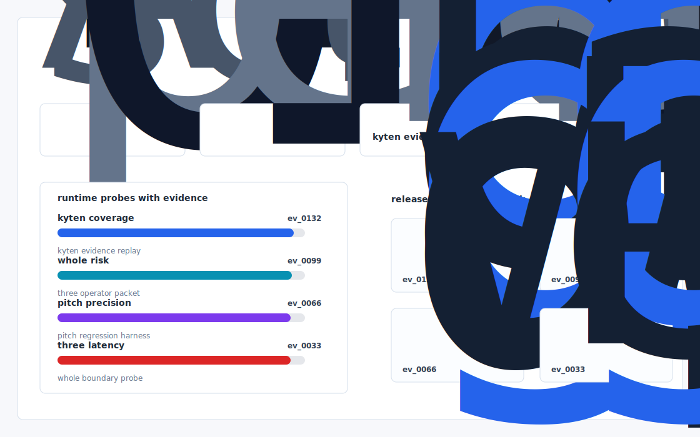

# Qual Loop

A test orchestration runtime + digital twin for aerospace battery qualification: schedules DO 160G + UN38.3 campaigns in maximum parallel, predicts pass/fail from the first 10% of each test, and emits a regulator grade evidence bundle.



## Why it exists

Kyten's whole pitch is a three week cycle: 1 week to design -> 1 week to qualify -> 1 week to volume. The 1 week to qualify claim is the most aggressive — real world aerospace battery qualification under DO 160G + UN38.3 + customer specific abuse profiles takes 8 — 16 weeks at most suppliers because test campaigns are sequential, instrumentation is hand.

The project is intentionally built as a local replay harness instead of a slide. It creates fixtures, plants realistic failure modes, produces citation-locked evidence, and turns the result into a dashboard a reviewer can inspect without credentials or hosted services.

## What is inside

- Deterministic fixture generation for the company-specific risk surface.
- Strategy code in `src/qual_loop/strategy.py` with project-specific scoring and visual evidence.
- Citation-locked reports where every decision claim points to a generated evidence ID.
- Two regenerated visual artifacts: `outputs/project_working.svg` and `outputs/evidence_map.svg`.
- A portable demo pack with JSON, CSV, Markdown, HTML, SVG, benchmark, and test artifacts.


## Signals it measures

- `kyten coverage`
- `whole risk`
- `pitch precision`
- `three latency`

## Failure modes it plants

- kyten drift
- whole gap
- pitch misroute
- three blindspot

## Run it locally

```bash
uv sync
uv run qual-loop all
uv run pytest -q
uv run ruff check .
```

## Outputs worth opening

- `outputs/dashboard.html`
- `outputs/project_working.svg`
- `outputs/evidence_map.svg`
- `outputs/operator_brief.md`
- `outputs/decision_report.md`
- `outputs/strategy_model.json`
- `outputs/demo_pack.zip`

## Sources

- https://www.ycombinator.com/companies/kyten-technologies
- https://www.ycombinator.com/launches/PIU-kyten-the-modern-aerospace-battery-pack-supplier
- https://x.com/maddox_lucas
- https://www.linkedin.com/in/lucasmaddox/
- https://www.linkedin.com/in/cooper-mcbride/
- https://advisingblog.ece.uw.edu/2026/03/24/wired-for-success-career-panels-cooper-mcbride-co-founder-kyten-former-space-x-4-29-330-p-m/
- https://www.batterydesign.net/legislation-rules-and-regulations/un38-3-transport-test/
- https://incompliancemag.com/an-overview-of-aerospace-battery-compliance/
- https://ntrs.nasa.gov/api/citations/20210009584/downloads/AIAA_BatteryScaling.pdf
- https://tracxn.com/d/companies/kytentech/__rCxrrADqobRURixJbkXFA9L7gyIdZbUznTW9kxtP-4Y

## Boundary

Everything runs locally against synthetic fixtures. There are no credentials, no customer records, no outreach files, and no hosted API dependency.
